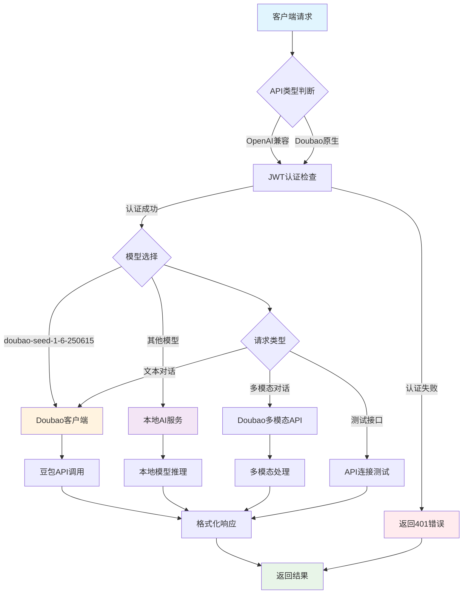
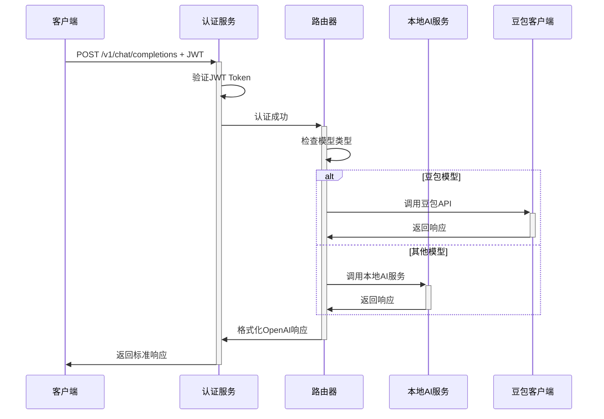
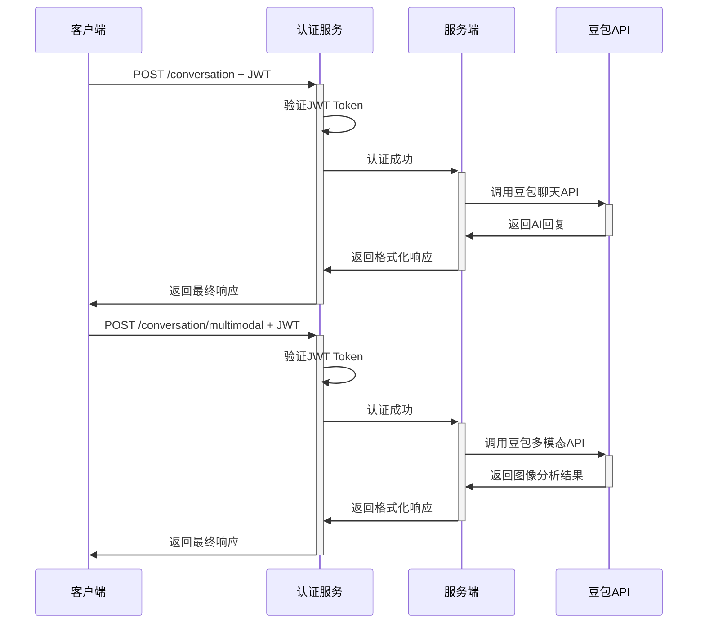

# AI English Speaking Learning Service API Documentation

## 概述

AI English Speaking Learning Service 是一个专业的英语口语学习服务，通过 AI 对话伙伴帮助用户提升英语口语能力。支持两种 API 格式：

- **OpenAI 兼容 API**: 完全兼容 OpenAI GPT API 格式，支持现有的 OpenAI SDK
- **Doubao API**: 专门为豆包 API 优化的原生接口

### 服务特性

- 🗣️ **专业口语助手**: 专注于英语口语学习和对话练习
- 🔄 **双 API 支持**: OpenAI 兼容 + Doubao 原生 API
- 🤖 **多模型支持**: 本地 AI 模型、GPT 模型、豆包模型
- 📚 **智能教学**: 基于苏格拉底方法的英语对话引导
- 🔐 **JWT 认证**: 安全的用户认证机制
- 🌊 **流式响应**: 支持实时流式对话
- 🖼️ **多模态**: 支持文本+图像的对话模式
- 🎯 **学习重点**: 发音指导、语法练习、流利度提升、自然对话

### 基础信息

- **Base URL**: `http://localhost:8000`
- **版本**: v1.0.0
- **协议**: HTTP/HTTPS
- **数据格式**: JSON

## 服务架构流程图



## 认证机制

### JWT Token 认证 (统一认证)

**所有 API 端点都需要 JWT 认证：**

- `/v1/*` - OpenAI 兼容 API 端点
- `/conversation/*` - Doubao 原生 API 端点
- `/test/doubao` - 测试端点

```http
Authorization: Bearer <jwt_token>
```

### 开发测试 Token

开发环境下可以使用测试 token：

```
dev-token-123
```

## API 端点详情

### 1. 健康检查端点

#### GET /

基础健康检查

**响应示例:**

```json
{
  "service": "AI English Speaking Learning Service",
  "version": "1.0.0",
  "status": "healthy",
  "purpose": "English conversation practice and learning",
  "apis": ["OpenAI-compatible", "Doubao"],
  "backend": "Local AI Models + Doubao",
  "features": [
    "Pronunciation help",
    "Grammar practice",
    "Fluency building",
    "Natural conversation"
  ],
  "timestamp": "2024-06-29T10:30:00.000Z"
}
```

#### GET /health

详细健康检查

**响应示例:**

```json
{
  "status": "healthy",
  "services": {
    "ai_service": true,
    "auth_service": true,
    "doubao_service": true
  },
  "config": {
    "use_local_model": true,
    "model_name": "local-tutor",
    "doubao_available": true
  },
  "timestamp": "2024-06-29T10:30:00.000Z"
}
```

### 2. OpenAI 兼容 API 端点

#### GET /v1/models

列出所有可用的 AI 模型

**请求头:**

```http
Authorization: Bearer <jwt_token>
```

**响应示例:**

```json
{
  "object": "list",
  "data": [
    {
      "id": "gpt-4-tutor",
      "object": "model",
      "created": 1719662400,
      "owned_by": "ai-tutor"
    },
    {
      "id": "gpt-3.5-turbo-tutor",
      "object": "model",
      "created": 1719662400,
      "owned_by": "ai-tutor"
    },
    {
      "id": "local-tutor",
      "object": "model",
      "created": 1719662400,
      "owned_by": "ai-tutor"
    },
    {
      "id": "doubao-seed-1-6-250615",
      "object": "model",
      "created": 1719662400,
      "owned_by": "doubao"
    }
  ]
}
```

#### POST /v1/chat/completions

创建聊天对话完成

**请求头:**

```http
Authorization: Bearer <jwt_token>
Content-Type: application/json
```

**请求体:**

```json
{
  "model": "gpt-4-tutor",
  "messages": [
    {
      "role": "system",
      "content": "You are a professional English speaking learning assistant. Help users improve their English through natural conversation and guidance."
    },
    {
      "role": "user",
      "content": "Hello! Can you help me practice pronunciation?"
    }
  ],
  "temperature": 0.7,
  "max_tokens": 1000,
  "stream": false
}
```

**响应示例:**

```json
{
  "id": "chatcmpl-abc123",
  "object": "chat.completion",
  "created": 1719662400,
  "model": "gpt-4-tutor",
  "choices": [
    {
      "index": 0,
      "message": {
        "role": "assistant",
        "content": "很好的问题！在我们深入了解二次方程之前，你能告诉我你对'方程'这个概念的理解吗？"
      },
      "finish_reason": "stop"
    }
  ],
  "usage": {
    "prompt_tokens": 45,
    "completion_tokens": 28,
    "total_tokens": 73
  }
}
```

**流式响应:**

设置 `"stream": true` 时，响应将以 SSE 格式流式传输：

```
data: {"id":"chatcmpl-abc123","object":"chat.completion.chunk","created":1719662400,"model":"gpt-4-tutor","choices":[{"index":0,"delta":{"role":"assistant","content":"很好"},"finish_reason":null}]}

data: {"id":"chatcmpl-abc123","object":"chat.completion.chunk","created":1719662400,"model":"gpt-4-tutor","choices":[{"index":0,"delta":{"content":"的问题"},"finish_reason":null}]}

data: [DONE]
```

#### GET /v1/language/session

获取用户的英语学习会话和对话历史

**设计说明:**

- 每个用户只有一个英语学习会话（简化设计）
- 首次访问时会自动创建默认会话
- 返回会话信息、完整对话历史和学习上下文

**响应示例:**

```json
{
  "session": {
    "id": "session_abc123",
    "user_id": "user_456",
    "language": "English",
    "level": "intermediate",
    "goals": ["Daily conversation", "Pronunciation improvement"],
    "created_at": "2024-06-29T10:30:00.000Z",
    "last_activity": "2024-06-29T10:35:00.000Z",
    "message_count": 5,
    "status": "active"
  },
  "history": [
    {
      "role": "system",
      "content": "You are a professional English speaking learning assistant..."
    },
    {
      "role": "user",
      "content": "Hi! I want to improve my pronunciation."
    },
    {
      "role": "assistant",
      "content": "Hello! I'm excited to help you with **pronunciation**! What specific sounds or words would you like to work on today?"
    }
  ],
  "learning_context": {
    "today_focus": "Pronunciation practice",
    "session_type": "conversation",
    "emotional_state": "engaged"
  }
}
```

### 3. Doubao 原生 API 端点

#### POST /conversation

创建文本对话

**请求头:**

```http
Authorization: Bearer <jwt_token>
Content-Type: application/json
```

**请求体:**

```json
{
  "message": "你好，请介绍一下自己",
  "user_id": "user_123",
  "model": "doubao-seed-1-6-250615"
}
```

**响应示例:**

```json
{
  "status": "success",
  "response": "你好！我是豆包，一个AI助手，很高兴为你服务。我可以帮助你解答问题、进行对话交流...",
  "user_id": "user_123",
  "model": "doubao-seed-1-6-250615",
  "timestamp": "2024-06-29T10:30:00.000Z"
}
```

#### POST /conversation/multimodal

创建多模态对话（文本+图像）

**请求头:**

```http
Authorization: Bearer <jwt_token>
Content-Type: application/json
```

**请求体:**

```json
{
  "text": "这张图片主要内容是什么？",
  "image_url": "https://example.com/image.jpg",
  "user_id": "user_123",
  "model": "doubao-seed-1-6-250615"
}
```

**响应示例:**

```json
{
  "status": "success",
  "response": "这张图片显示的是一个数学公式，具体是二次方程的标准形式：ax² + bx + c = 0...",
  "user_id": "user_123",
  "model": "doubao-seed-1-6-250615",
  "timestamp": "2024-06-29T10:30:00.000Z"
}
```

#### POST /test/doubao

测试 Doubao API 连接

**请求头:**

```http
Authorization: Bearer <jwt_token>
```

**响应示例:**

```json
{
  "status": "success",
  "message": "Doubao API连接测试成功!",
  "test_response": "你好，这是一个API连接测试的回复...",
  "timestamp": "2024-06-29T10:30:00.000Z"
}
```

## 数据模型

### ChatMessage

```typescript
interface ChatMessage {
  role: "system" | "user" | "assistant" | "function";
  content: string;
  name?: string;
  function_call?: object;
}
```

### ChatCompletionRequest

```typescript
interface ChatCompletionRequest {
  model: string; // 模型名称
  messages: ChatMessage[]; // 对话消息列表
  temperature?: number; // 采样温度 (0.0-2.0)
  max_tokens?: number; // 最大生成tokens
  top_p?: number; // 核采样参数 (0.0-1.0)
  n?: number; // 生成完成数量 (1-128)
  stream?: boolean; // 是否流式响应
  stop?: string | string[]; // 停止序列
  presence_penalty?: number; // 存在惩罚 (-2.0-2.0)
  frequency_penalty?: number; // 频率惩罚 (-2.0-2.0)
  logit_bias?: Record<string, number>; // logit偏置
  user?: string; // 用户标识
}
```

### ConversationRequest (Doubao)

```typescript
interface ConversationRequest {
  message: string; // 用户消息
  user_id: string; // 用户ID
  model?: string; // 模型名称，默认doubao-seed-1-6-250615
}
```

### MultimodalConversationRequest (Doubao)

```typescript
interface MultimodalConversationRequest {
  text: string; // 文本内容
  image_url: string; // 图片URL
  user_id: string; // 用户ID
  model?: string; // 模型名称
}
```

## 错误处理

### HTTP 状态码

- `200` - 请求成功
- `400` - 请求参数错误
- `401` - 认证失败
- `403` - 权限不足
- `404` - 资源不存在
- `429` - 请求频率限制
- `500` - 服务器内部错误

### 错误响应格式

```json
{
  "detail": "Error creating completion: Invalid model specified",
  "type": "validation_error",
  "timestamp": "2024-06-29T10:30:00.000Z"
}
```

## 使用示例

### Python SDK (OpenAI 兼容)

```python
import openai

# 配置客户端
client = openai.OpenAI(
    api_key="your-jwt-token",
    base_url="http://localhost:8000/v1"
)

# 创建对话
response = client.chat.completions.create(
    model="gpt-4-tutor",
    messages=[
        {"role": "system", "content": "你是一个专业的AI导师"},
        {"role": "user", "content": "解释一下牛顿第二定律"}
    ]
)

print(response.choices[0].message.content)

# 流式对话
stream = client.chat.completions.create(
    model="gpt-4-tutor",
    messages=[{"role": "user", "content": "什么是机器学习？"}],
    stream=True
)

for chunk in stream:
    if chunk.choices[0].delta.content is not None:
        print(chunk.choices[0].delta.content, end="")
```

### cURL (Doubao 原生 API)

```bash
# 文本对话
curl -X POST "http://localhost:8000/conversation" \
  -H "Authorization: Bearer your-jwt-token" \
  -H "Content-Type: application/json" \
  -d '{
    "message": "你好，请介绍一下自己",
    "user_id": "user_123"
  }'

# 多模态对话
curl -X POST "http://localhost:8000/conversation/multimodal" \
  -H "Authorization: Bearer your-jwt-token" \
  -H "Content-Type: application/json" \
  -d '{
    "text": "这张图片内容是什么？",
    "image_url": "https://example.com/image.jpg",
    "user_id": "user_123"
  }'
```

### JavaScript/TypeScript

```typescript
// OpenAI兼容调用
const response = await fetch("http://localhost:8000/v1/chat/completions", {
  method: "POST",
  headers: {
    Authorization: "Bearer your-jwt-token",
    "Content-Type": "application/json",
  },
  body: JSON.stringify({
    model: "gpt-4-tutor",
    messages: [{ role: "user", content: "什么是量子计算？" }],
  }),
});

const data = await response.json();
console.log(data.choices[0].message.content);

// Doubao原生调用
const doubaoResponse = await fetch("http://localhost:8000/conversation", {
  method: "POST",
  headers: {
    Authorization: "Bearer your-jwt-token",
    "Content-Type": "application/json",
  },
  body: JSON.stringify({
    message: "介绍一下人工智能",
    user_id: "user_456",
  }),
});

const doubaoData = await doubaoResponse.json();
console.log(doubaoData.response);
```

## API 流程图

### OpenAI 兼容 API 流程



### Doubao 原生 API 流程



## 部署和配置

### 环境变量

```bash
# 服务配置
DEBUG=true
PORT=8000

# AI模型配置
USE_LOCAL_MODEL=true
MODEL_NAME=local-tutor

# 认证配置
JWT_SECRET=your-secret-key-change-in-production

# 外部服务
USER_SERVICE_URL=http://user-service:8001
REDIS_URL=redis://localhost:6379

# 豆包API配置
DOUBAO_API_KEY=your-doubao-api-key-here

# 日志配置
LOG_LEVEL=INFO
```

### 运行服务

```bash
# 使用uv运行
cd services/conversation-service
uv run python main.py

# 或使用Docker
docker build -t conversation-service .
docker run -p 8000:8000 conversation-service
```

### API 文档访问

- Swagger UI: `http://localhost:8000/docs`
- ReDoc: `http://localhost:8000/redoc`

## 性能和限制

### 速率限制

- 每用户每分钟最多 100 次请求
- 大模型推理请求每分钟最多 10 次

### 响应时间

- 健康检查: < 100ms
- 文本对话: 1-5 秒
- 多模态对话: 3-10 秒
- 流式响应: 首字符 < 1 秒

### 输入限制

- 单次对话最大 tokens: 4096
- 图片文件大小: < 10MB
- 支持图片格式: JPG, PNG, WebP

## 监控和日志

### 监控指标

- 请求 QPS
- 响应延迟
- 错误率
- 模型推理时间

### 日志格式

```json
{
  "timestamp": "2024-06-29T10:30:00.000Z",
  "level": "INFO",
  "service": "conversation-service",
  "endpoint": "/v1/chat/completions",
  "user_id": "user_123",
  "model": "gpt-4-tutor",
  "duration_ms": 1250,
  "status": "success"
}
```
