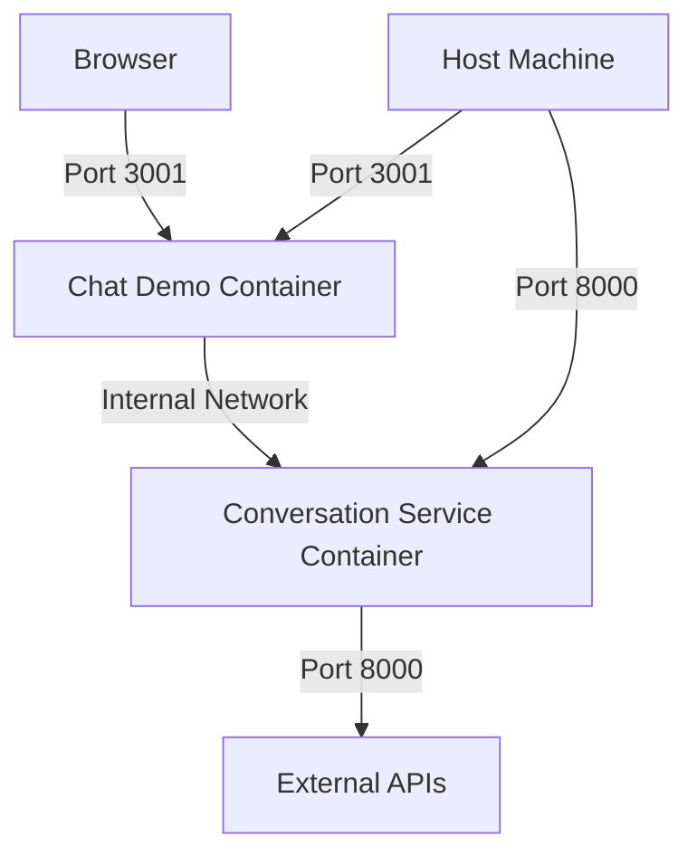

# 🐳 AI Tutor Docker Setup

This directory contains Docker Compose configuration to run the entire AI Tutor system with a single command.

## 🚀 Quick Start

### Prerequisites

- Docker Desktop or Docker Engine installed
- Docker Compose (usually included with Docker Desktop)

### Simple Startup

```bash
cd scripts/
./docker-start.sh
```

### Manual Startup

```bash
cd scripts/
docker-compose up --build -d
```

## 📁 What Gets Started

The Docker Compose setup includes:

### 🤖 Conversation Service

- **Container**: `ai-tutor-conversation-service`
- **Port**: `8000`
- **API**: http://localhost:8000
- **Docs**: http://localhost:8000/docs
- **Models**: Gemini 2.5 Flash, DeepSeek Chat, Doubao Seed, Local Tutor

### 💬 Chat Demo

- **Container**: `ai-tutor-chat-demo`
- **Port**: `3001`
- **URL**: http://localhost:3001
- **Features**: Modern web interface, dev-token authentication

## ⚙️ Configuration

### Environment Variables

Create a `.env` file in the scripts directory to configure API keys:

```bash
# Copy the example (if it exists)
cp .env.example .env

# Or create manually
cat > .env << EOF
# External AI API Keys (optional)
DOUBAO_API_KEY=your_doubao_api_key_here
DEEPSEEK_API_KEY=your_deepseek_api_key_here
GEMINI_API_KEY=your_gemini_api_key_here

# Service Configuration
DEBUG=true
HOST=0.0.0.0
PORT=8000
LOG_LEVEL=INFO
EOF
```

### Without API Keys

The system works in demo mode without any API keys configured. All models will use intelligent simulation responses.

## 🔧 Management Commands

### Start Services

```bash
./docker-start.sh                    # Recommended (with health checks)
docker-compose up --build -d         # Manual startup
docker-compose up --build            # Foreground mode
```

### Stop Services

```bash
./docker-stop.sh                     # Recommended
docker-compose down                  # Manual stop
docker-compose down -v               # Stop and remove volumes
```

### View Logs

```bash
docker-compose logs -f               # All services
docker-compose logs -f conversation-service
docker-compose logs -f chat-demo
```

### Check Status

```bash
docker-compose ps                    # Service status
docker-compose top                   # Process information
```

### Restart Services

```bash
docker-compose restart               # Restart all
docker-compose restart conversation-service
docker-compose restart chat-demo
```

## 🧪 Testing the Setup

### 1. Check Service Health

```bash
# Conversation Service
curl -H "Authorization: Bearer dev-token" http://localhost:8000/v1/models

# Chat Demo
curl http://localhost:3001
```

### 2. Test Chat Completion

```bash
curl -X POST "http://localhost:8000/v1/chat/completions" \
  -H "Authorization: Bearer dev-token" \
  -H "Content-Type: application/json" \
  -d '{
    "model": "gemini-2.5-flash",
    "messages": [{"role": "user", "content": "Hello!"}],
    "temperature": 0.7
  }'
```

### 3. Use Web Interface

1. Open http://localhost:3001
2. Ensure "Server URL" is `http://localhost:8000`
3. Use `dev-token` as the Auth Token
4. Click "Connect" and start chatting!

## 🔍 Troubleshooting

### Services Won't Start

```bash
# Check Docker status
docker info

# Check logs for errors
docker-compose logs

# Rebuild from scratch
docker-compose down -v
docker-compose build --no-cache
docker-compose up -d
```

### Connection Issues

```bash
# Check if ports are available
netstat -tulpn | grep -E ':8000|:3001'

# Check container networking
docker-compose exec conversation-service curl http://localhost:8000/v1/models -H "Authorization: Bearer dev-token"
```

### Performance Issues

```bash
# Check resource usage
docker stats

# Free up space
docker system prune

# Check available resources
docker system df
```

## 🌐 Network Architecture



### Internal Communication

- Chat Demo connects to Conversation Service via `http://conversation-service:8000`
- Both services are on the `ai-tutor-network` bridge network
- Health checks ensure proper startup order

### External Access

- **Chat Demo**: http://localhost:3001
- **Conversation API**: http://localhost:8000
- **API Docs**: http://localhost:8000/docs

## 🔐 Security Notes

### Development Mode

- The setup runs in `DEBUG=true` mode
- `dev-token` authentication is enabled
- CORS is configured for development

### Production Considerations

- Set `DEBUG=false`
- Use proper JWT authentication
- Configure environment-specific API keys
- Use reverse proxy (nginx) for production
- Enable SSL/TLS
- Implement proper secrets management

## 📊 Monitoring

### Health Checks

Both services include health checks:

- **Conversation Service**: API endpoint test with dev-token
- **Chat Demo**: HTTP response test

### Logs

```bash
# Follow all logs
docker-compose logs -f

# Service-specific logs
docker-compose logs -f conversation-service
docker-compose logs -f chat-demo

# Last N lines
docker-compose logs --tail=50 conversation-service
```

## 🚧 Development

### Making Changes

1. Edit source code in `services/conversation-service/` or `demo_apps/chat-demo/`
2. Rebuild affected service:
   ```bash
   docker-compose build conversation-service
   docker-compose up -d conversation-service
   ```
3. Or rebuild everything:
   ```bash
   docker-compose down
   docker-compose up --build -d
   ```

### Volume Mounts for Development

To enable live reloading during development, you can add volume mounts:

```yaml
# Add to docker-compose.yml services
volumes:
  - ../services/conversation-service:/app
  - ../demo_apps/chat-demo:/app
```

## 📝 Files Structure

```
scripts/
├── docker-compose.yml      # Main orchestration file
├── docker-start.sh         # Helper startup script
├── docker-stop.sh          # Helper stop script
├── .env.example           # Environment template
└── README.md              # This file

../services/conversation-service/
└── Dockerfile             # Conversation service image

../demo_apps/chat-demo/
└── Dockerfile             # Chat demo image
```

## 🤝 Contributing

To add new services to the Docker setup:

1. Create Dockerfile in the service directory
2. Add service definition to `docker-compose.yml`
3. Update networking and dependencies
4. Add health checks
5. Update this README

---

Happy coding! 🎉 For issues, check the logs first, then the troubleshooting section above.
